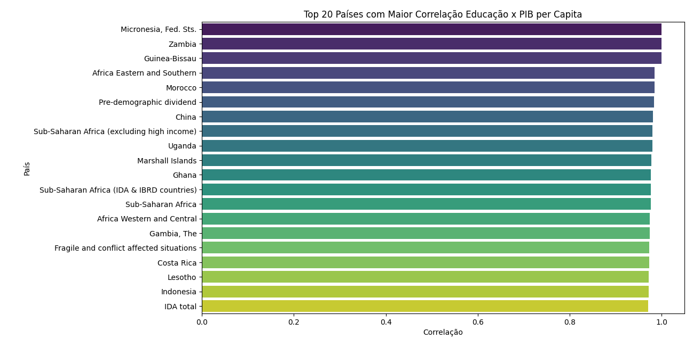
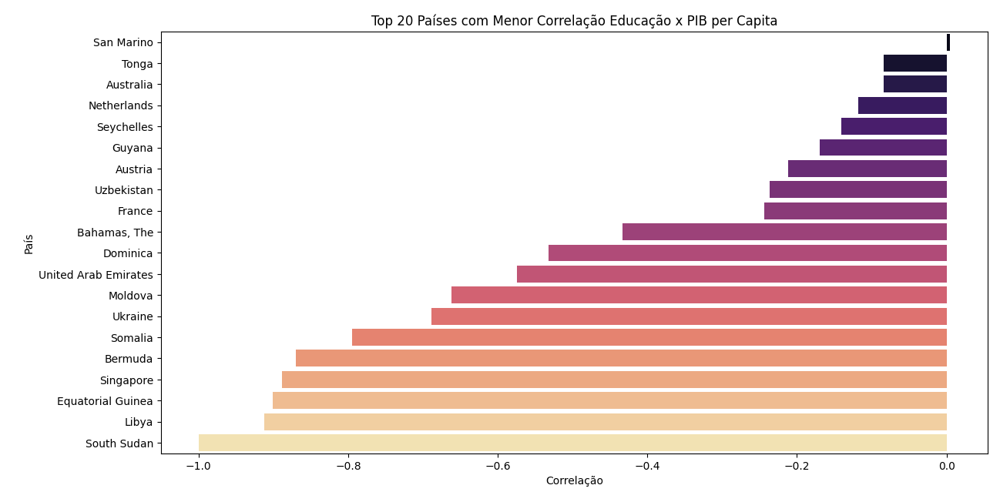
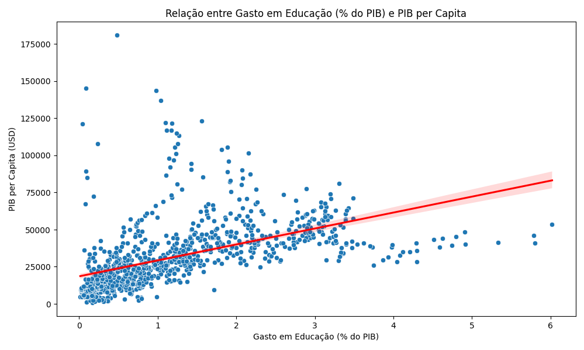
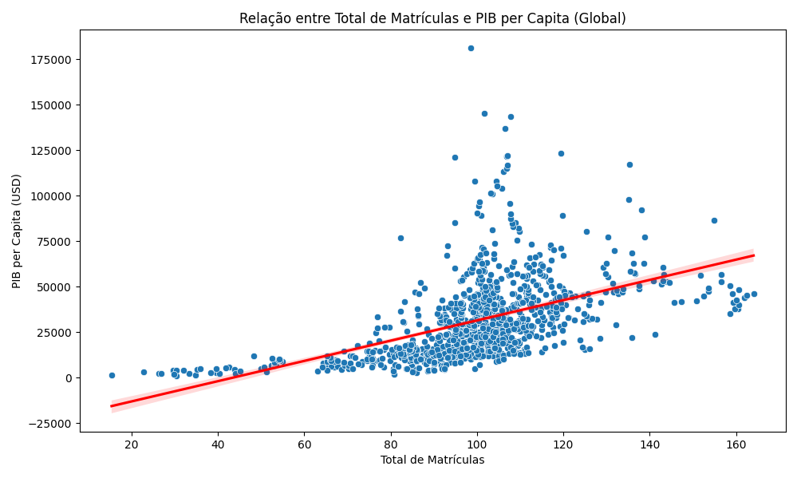

# Análise da Relação entre Educação e Crescimento Econômico

## 📌 Visão Geral do Projeto

Este projeto de Data Science investiga a complexa relação entre investimentos/resultados educacionais e o crescimento econômico (PIB per capita) em diversos países. Utilizando dados do Banco Mundial, a análise vai além de uma correlação global simples e examina como essa relação varia entre diferentes contextos nacionais, oferecendo insights valiosos para a formulação de políticas públicas personalizadas.

**Hipótese Central:** O impacto da educação na economia não é uniforme; varia drasticamente dependendo do estágio de desenvolvimento e da estrutura econômica de cada país.

## 📊 Fontes de Dados

Os dados foram extraídos do **Banco Mundial** (World Development Indicators) e incluem métricas para uma ampla gama de países e anos. As principais variáveis utilizadas foram:

-   **Variável Alvo (Target):** `PIB per capita (current US$)`
-   **Variáveis de Educação:**
    -   `Gasto em Educação (% do PIB)`
    -   `Gasto Total em Educação (US$)`
    -   `Total de Matrículas`
    -   `Taxa de Matrícula no Ensino Secundário (%)`

## 🧪 Metodologia

A análise empregou uma abordagem de três etapas:

1.  **Correlação Global:** Cálculo da correlação de Pearson entre o PIB per capita e cada indicador educacional para todos os países, tratados como um único conjunto.
2.  **Correlação por País:** Cálculo da correlação entre as séries temporais do PIB per capita e de cada indicador educacional **para cada país individualmente**. Esta é a etapa mais importante, pois captura a relação específica de cada contexto nacional.
3.  **Análise Visual:** Criação de gráficos de dispersão e de barras para visualizar as relações e padrões identificados nas etapas anteriores.

## 🔍 Principais Resultados e Insights
GDP_per_capita 1.000000
Edu_Expenditure_Pct_GDP 0.511367
Total_Enrollment 0.494226
Secondary_Enrollment_Percent 0.374014
Edu_Total_Expenditure 0.205281


### 2. A Relação é Contextual (Insight Principal)
A análise por país revelou que a força da correlação é altamente dependente do contexto nacional.

| Contexto do País | Correlação com PIB | Implicação para Políticas Públicas |
| :--- | :--- | :--- |
| **Países em Desenvolvimento e Frágeis** (ex: Fed. States of Micronesia, Gana, Uganda) | **Forte e Positiva** | A educação é um **motor de crescimento** fundamental. Investimentos em acesso e gasto são estratégicos e têm alto retorno. |
| **Economias Baseadas em Recursos** (ex: Emirados Árabes, Líbia, Guiné Equatorial) | **Fraca ou Negativa** | A economia é movida por commodities. A política deve focar em **usar a riqueza para diversificar a economia** via educação, preparando para o pós-rentismo. |
| **Economias Avançadas** (ex: Austrália, Holanda, Singapura) | **Fraca ou Neutra** | O alto patamar educacional já foi alcançado. O foco deve ser em **qualidade, inovação e aprendizado contínuo** para manter a vantagem competitiva. |

*Top 20 países com maior e menor correlação:*



### 3. Gasto em Educação: Condição Necessária, mas não Suficiente
O gráfico de dispersão entre gasto em educação (% do PIB) e PIB per capita revela um padrão crucial em forma de "triângulo".
-   **Não há países ricos que gastem pouco com educação** (condição necessária).
-   **Há países que gastam muito e ainda assim têm PIB médio ou baixo** (condição não-suficiente).



**Implicação:** A simples alocação de verba não garante crescimento. A **eficiência do gasto**, o combate à corrupção e a qualidade do ensino são fatores críticos.

### 4. Universalização do Acesso é o Piso, a Qualidade é o Teto
O gráfico de dispersão entre total de matrículas e PIB per capita mostra que:
-   **É virtualmente impossível ser rico sem ter universalizado o acesso** à educação (vácuo no canto superior esquerdo).
-   **Universalizar o acesso não garante riqueza** (grande dispersão no lado direito do gráfico).



**Implicação:** Garantir o acesso é a **base não negociável**. Porém, para dar o salto de desenvolvimento, o foco das políticas deve evoluir da **quantidade** para a **qualidade e relevância** da educação para a economia.

## 🚀 Como Reproduzir a Análise

### Pré-requisitos
-   Python 3.x
-   Gerenciador de pacotes `pip`

### Instalação
1.  Clone este repositório:
    ```bash
    git clone https://github.com/seu-usuario/mb-education-economic-growth.git
    cd mb-education-economic-growth
    ```
2.  (Opcional) Crie e ative um ambiente virtual:
    ```bash
    python -m venv venv
    source venv/bin/activate  # Para Linux/macOS
    # ou
    .\venv\Scripts\activate  # Para Windows
    ```
3.  Instale as dependências:
    ```bash
    pip install -r requirements.txt
    ```

### Execução
Execute o script principal do projeto:
```bash
python mb-education-economic-growth.py

### 📂 Estrutura do Projeto
mb-education-economic-growth/
├── data/                   # Diretório para armazenar os dados brutos e processados
├── notebooks/              # (Opcional) Jupyter notebooks para análise exploratória
├── protinho.py             # Script principal de análise
├── requirements.txt        # Lista de dependências do Python
├── viridis.png             # Gráfico - Top 20 correlações
├── magma.png               # Gráfico - Bottom 20 correlações
├── gasxpercap.png          # Gráfico - Dispersão Gasto x PIB
├── mtxpib.png              # Gráfico - Dispersão Matrículas x PIB
└── README.md               # Este arquivo

----

### 🛠 Tecnologias Utilizadas
Linguagem: Python

Principais Bibliotecas: pandas, numpy, matplotlib, seaborn, scipy

Fonte de Dados: Banco Mundial (World Development Indicators)

👤 Autor
Roberto da Cunha

LinkedIn: link para o seu LinkedIn

GitHub: @rhccarmo21

📄 Licença
Este projeto está sob a licença MIT. Veja o arquivo LICENSE para mais detalhes.

Nota: Este projeto é uma análise exploratória. Correlação não implica causalidade. Estudos futuros podem empregar métodos mais robustos (e.g., dados em painel com defasagem temporal) para investigar melhor a relação causal.

### 1. Correlação Global Moderada
A análise inicial confirmou uma relação positiva, porém moderada, entre educação e economia no agregado global.
